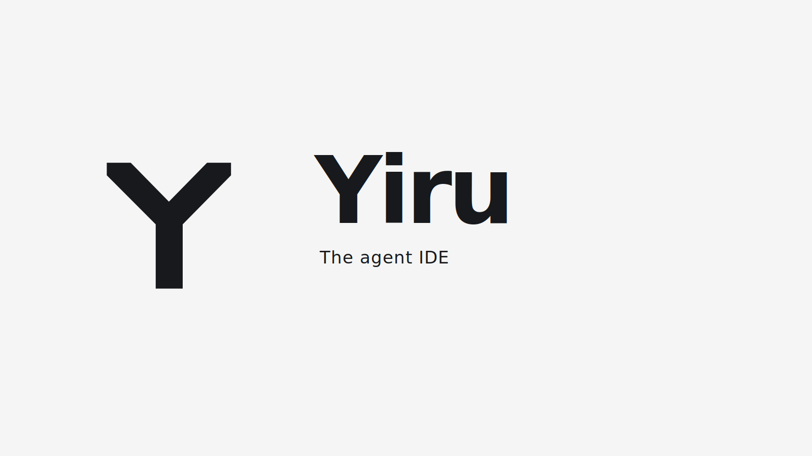

<h1 align="center">
  <a href="https://onYiru.dev"></a> Yiru
</h1>

<p align="center">
  <a href="https://github.com/paperboytm/yiru/stargazers"></a>
  <a href="https://github.com/paperboytm/yiru/releases"></a>
  
  <a href="https://discord.gg/fzjDKHxv8Q"></a>
  <a href="https://x.com/yiru_build"></a>
  
</p>

<p align="center">
  <sub><a href="../../README.md">English</a> · <a href="README.pt.md">Português</a> · <a href="README.zh-CN.md">中文</a> · <a href="README.ja.md">日本語</a> · <a href="README.ko.md">한국어</a></sub>
</p>

<p align="center">
  <strong>El orquestador de IA para desarrolladores 100x.</strong><br/>
  Ejecuta Codex, Claude Code, OpenCode u Pi en paralelo — cada uno en su propio worktree, supervisados desde un solo lugar.
</p>

<h3 align="center"><a href="https://onyiru.dev/download"><ins>Descargar Yiru</ins></a></h3>

<p align="center">
  
</p>

## Características

<table>
<tr>
<td width="50%" valign="middle">

### App companion móvil

Supervisa y dirige a tus agentes desde el teléfono — recibe una notificación cuando un agente termine y envía instrucciones de seguimiento desde cualquier lugar.

[App Store de iOS](https://apps.apple.com/us/app/yiru/id6766130217) · [APK para Android](https://github.com/paperboytm/yiru/releases/download/mobile-android-v0.0.31/app-release.apk) · [Docs →](https://www.onyiru.dev/docs/mobile)

</td>
<td width="50%">
</td>
</tr>
<tr>
<td width="50%" valign="middle">

### Worktrees en paralelo

Lanza un mismo prompt a cinco agentes, cada uno en su propio worktree de git aislado — compara los resultados y haz merge del ganador.

[Docs →](https://www.onyiru.dev/docs/model/worktrees)

</td>
<td width="50%">
</td>
</tr>
<tr>
<td width="50%" valign="middle">

### Terminales divididas

Terminales de nivel Ghostty con renderizado WebGL, divisiones infinitas y un scrollback que sobrevive a los reinicios.

[Docs →](https://www.onyiru.dev/docs/terminal)

</td>
<td width="50%">
</td>
</tr>
<tr>
<td width="50%" valign="middle">

### Modo diseño

Haz clic en cualquier elemento de UI en una ventana real de Chromium para enviar su HTML, su CSS y una captura recortada directo al prompt de tu agente.

[Docs →](https://www.onyiru.dev/docs/browser/design-mode)

</td>
<td width="50%">
</td>
</tr>
<tr>
<td width="50%" valign="middle">

### GitHub y Linear, nativos

Explora PRs, issues y tableros de proyecto dentro de la app — abre un worktree desde cualquier tarea y revisa sin cambiar de contexto.

[Docs →](https://www.onyiru.dev/docs/review/linear)

</td>
<td width="50%">
</td>
</tr>
<tr>
<td width="50%" valign="middle">

### Worktrees por SSH

Ejecuta agentes en una máquina remota potente con edición completa de archivos, git y terminales — con reconexión automática y reenvío de puertos incluidos.

[Docs →](https://www.onyiru.dev/docs/ssh)

</td>
<td width="50%">
</td>
</tr>
<tr>
<td width="50%" valign="middle">

### Anotar diffs de IA

Deja comentarios en cualquier línea de un diff y envíalos de vuelta al agente — revisa, edita y haz commit sin salir de Yiru.

[Docs →](https://www.onyiru.dev/docs/review/annotate-ai-diff)

</td>
<td width="50%">
</td>
</tr>
<tr>
<td width="50%" valign="middle">

### Arrastra archivos a los agentes

El editor de VS Code con autoguardado en todas partes — arrastra archivos o imágenes directo al prompt de un agente.

[Docs →](https://www.onyiru.dev/docs/editing/file-explorer)

</td>
<td width="50%">
</td>
</tr>
<tr>
<td width="50%" valign="middle">

### Yiru CLI

Los agentes también manejan Yiru — automatiza cualquier flujo de trabajo con `yiru worktree create`, `snapshot`, `click` y `fill`.

[Docs →](https://www.onyiru.dev/docs/cli/overview)

</td>
<td width="50%">
</td>
</tr>
</table>

**También incluye:**

- **[Apertura rápida](https://www.onyiru.dev/docs/model/quick-open)** — Busca entre worktrees, archivos, agentes, comandos y contexto del repo sin salir de tu flujo.
- **[Cambio de cuenta y seguimiento de uso](https://www.onyiru.dev/docs/agents/usage-tracking)** — Consulta el uso de Claude y Codex y los reinicios de límites de uso, y cambia de cuenta al instante sin volver a iniciar sesión.
- **[Previews ricos del repo](https://www.onyiru.dev/docs/editing/markdown)** — Previsualiza Markdown, imágenes, PDFs y documentos del repo en el workspace.
- **[Computer Use](https://www.onyiru.dev/docs/cli/computer-use)** — Deja que los agentes manejen apps de escritorio y UI visible cuando un flujo de trabajo necesita interacción real.
- **[Notificaciones y estado de no leído](https://www.onyiru.dev/docs/notifications)** — Entérate cuando un agente termine o necesite tu atención, y marca hilos como no leídos para retomarlos después.
- **Y muchas, muchas más** — lanzamos a diario, así que esta lista siempre va atrasada. El [changelog](https://github.com/paperboytm/yiru/releases) es la verdadera lista de funciones.

---

## Agentes compatibles

Funciona con **cualquier agente CLI** — si corre en una terminal, corre en Yiru.

<p>
  <a href="https://docs.anthropic.com/claude/docs/claude-code"><kbd> Claude Code</kbd></a> &nbsp;
  <a href="https://github.com/openai/codex"><kbd> Codex</kbd></a> &nbsp;
  <a href="https://x.ai/cli"><kbd> Grok</kbd></a> &nbsp;
  <a href="https://cursor.com/cli"><kbd> Cursor</kbd></a> &nbsp;
  <a href="https://docs.github.com/en/copilot/how-tos/set-up/install-copilot-cli"><kbd> GitHub Copilot</kbd></a> &nbsp;
  <a href="https://opencode.ai/docs/cli/"><kbd> OpenCode</kbd></a> &nbsp;
  <a href="https://ampcode.com/manual#install"><kbd> Amp</kbd></a> &nbsp;
  <a href="https://openclaude.gitlawb.com/"><kbd> OpenClaude</kbd></a> &nbsp;
  <a href="https://antigravity.google/docs/cli-overview"><kbd> Antigravity</kbd></a> &nbsp;
  <a href="https://pi.dev"><kbd> Pi</kbd></a> &nbsp;
  <a href="https://omp.sh"><kbd> oh-my-pi</kbd></a> &nbsp;
  <a href="https://hermes-agent.nousresearch.com/docs/"><kbd> Hermes Agent</kbd></a> &nbsp;
  <a href="https://block.github.io/goose/docs/quickstart/"><kbd> Goose</kbd></a> &nbsp;
  <a href="https://docs.augmentcode.com/cli/overview"><kbd> Auggie</kbd></a> &nbsp;
  <a href="https://github.com/autohandai/code-cli"><kbd> Autohand Code</kbd></a> &nbsp;
  <a href="https://github.com/charmbracelet/crush"><kbd> Charm</kbd></a> &nbsp;
  <a href="https://docs.cline.bot/cline-cli/overview"><kbd> Cline</kbd></a> &nbsp;
  <a href="https://www.codebuff.com/docs/help/quick-start"><kbd> Codebuff</kbd></a> &nbsp;
  <a href="https://commandcode.ai/docs/quickstart"><kbd> Command Code</kbd></a> &nbsp;
  <a href="https://docs.continue.dev/guides/cli"><kbd> Continue</kbd></a> &nbsp;
  <a href="https://docs.factory.ai/cli/getting-started/quickstart"><kbd> Droid</kbd></a> &nbsp;
  <a href="https://kilo.ai/docs/cli"><kbd> Kilocode</kbd></a> &nbsp;
  <a href="https://www.kimi.com/code/docs/en/kimi-code-cli/getting-started.html"><kbd> Kimi</kbd></a> &nbsp;
  <a href="https://kiro.dev/docs/cli/"><kbd> Kiro</kbd></a> &nbsp;
  <a href="https://github.com/mistralai/mistral-vibe"><kbd> Mistral Vibe</kbd></a> &nbsp;
  <a href="https://github.com/QwenLM/qwen-code"><kbd> Qwen Code</kbd></a> &nbsp;
  <a href="https://support.atlassian.com/rovo/docs/install-and-run-rovo-dev-cli-on-your-device/"><kbd> Rovo Dev</kbd></a> &nbsp;
  <kbd>+ any CLI agent</kbd>
</p>

---

## Instalación

### Escritorio — macOS, Windows, Linux

- **[Descarga desde onYiru.dev](https://onyiru.dev/download)**
- O descarga un build directamente: [macOS Apple Silicon](https://github.com/paperboytm/yiru/releases/latest/download/yiru-macos-arm64.dmg) · [macOS Intel](https://github.com/paperboytm/yiru/releases/latest/download/yiru-macos-x64.dmg) · [Windows (.exe)](https://github.com/paperboytm/yiru/releases/latest/download/yiru-windows-setup.exe) · [Linux AppImage](https://github.com/paperboytm/yiru/releases/latest/download/yiru-linux.AppImage) · [Todos los builds](https://github.com/paperboytm/yiru/releases/latest)

_O mediante un gestor de paquetes:_

```bash
# macOS (Homebrew)
brew install --cask stablyai/yiru/yiru

# Arch Linux (AUR) — or stably-yiru-git to build from source
yay -S stably-yiru-bin
```

### App companion móvil — iOS, Android

Vincúlala con tu app de escritorio para supervisar y dirigir a tus agentes desde el teléfono.

- **iOS:** [Descargar desde App Store](https://apps.apple.com/us/app/yiru/id6766130217)
- **Android:** [Descargar el APK](https://github.com/paperboytm/yiru/releases/download/mobile-android-v0.0.31/app-release.apk)

---

## Comunidad y soporte

- **Discord:** Únete a la comunidad en **[Discord](https://discord.gg/fzjDKHxv8Q)**.
- **Twitter / X:** Sigue a **[@yiru_build](https://x.com/yiru_build)** para novedades y anuncios.
- **Feedback e ideas:** Lanzamos rápido. ¿Te falta algo? [Pide una nueva feature](https://github.com/paperboytm/yiru/issues).
- **Privacidad:** Consulta la [documentación de privacidad y telemetría](https://www.onyiru.dev/docs/telemetry) para saber qué datos anónimos de uso recopila Yiru y cómo desactivar su envío.
- **Muéstranos tu apoyo:** Dale una [estrella](https://github.com/paperboytm/yiru) a este repo para seguir nuestros lanzamientos diarios.

---

## Desarrollo

¿Quieres contribuir o ejecutar Yiru localmente? Consulta nuestra guía [CONTRIBUTING.md](../../.github/CONTRIBUTING.md).

<a href="https://github.com/paperboytm/yiru/graphs/contributors">
  
</a>

## Licencia

Yiru es libre y de código abierto bajo la [Licencia MIT](../../LICENSE).
